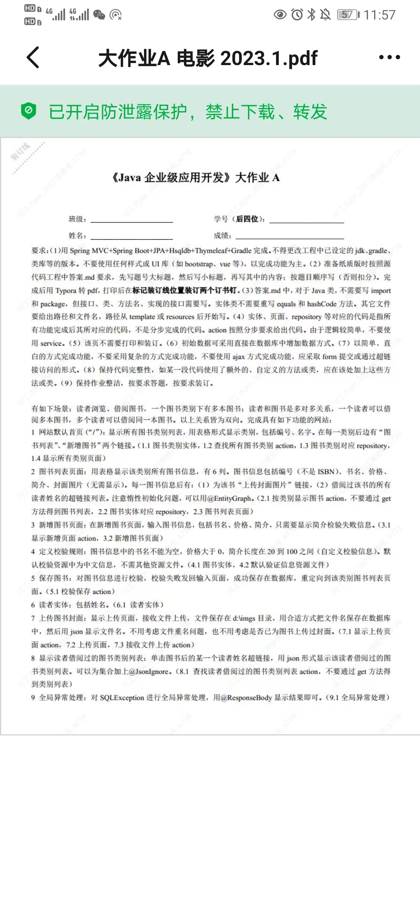
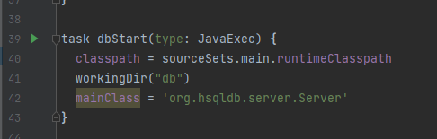
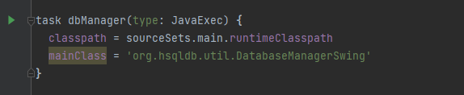
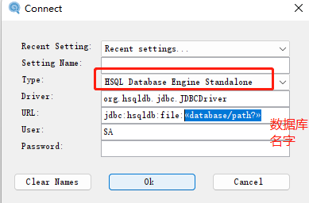
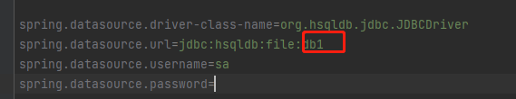
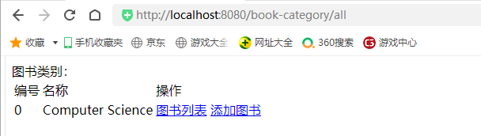

# 《Java企业级应用开发》大作业 A

[TOC]

# 1 自动步骤
## step1： 
启动hsql内存数据库，运行bulid.gradle中脚本

note：hsqldb是jvm内置数据库，不需要额外下载安装，并且服务器只能连接自己所在jvm内置hsqldb，不能跨jvm进行连接访问



## step2：
启动hsql界面管理，运行build.gradle中脚本


## step3：创建连接



## step4：创建数据库和表

```roomsql
// An highlighted block
var foo = 'bar';

CREATE TABLE book_category (
id BIGINT GENERATED BY DEFAULT AS IDENTITY PRIMARY KEY,
name VARCHAR(255) NOT NULL,
create_time DATETIME,
update_time DATETIME
)

CREATE TABLE book (
id BIGINT GENERATED BY DEFAULT AS IDENTITY PRIMARY KEY,
name VARCHAR(255) NOT NULL,
category_id BIGINT,
price INT NOT NULL,
description VARCHAR(255),
cover VARCHAR(255),
create_time DATETIME,
update_time DATETIME
);

-- 书种类准备数据
INSERT INTO book_category (name) VALUES ('Computer Science')
```
## step5：修改application数据库名字为上面创建的数据库名字



## step6：浏览器访问主页

```properties
  localhost:8080/book_category/all
```

